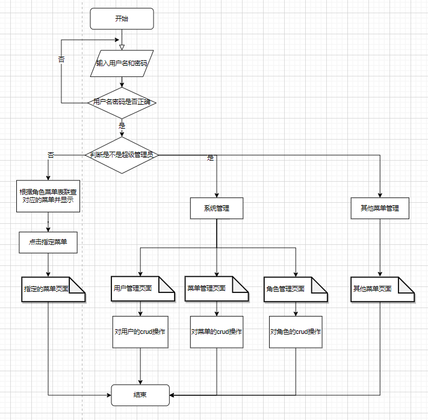
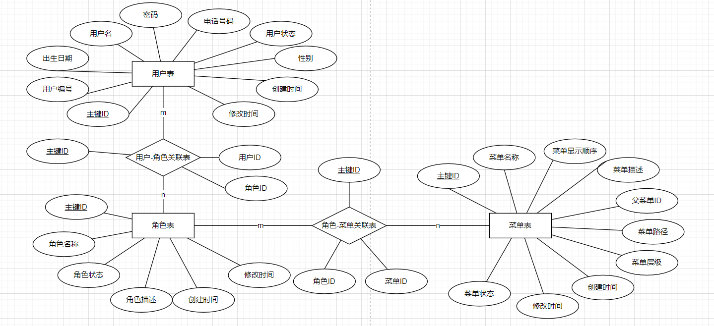
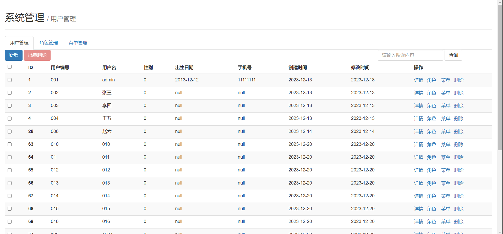
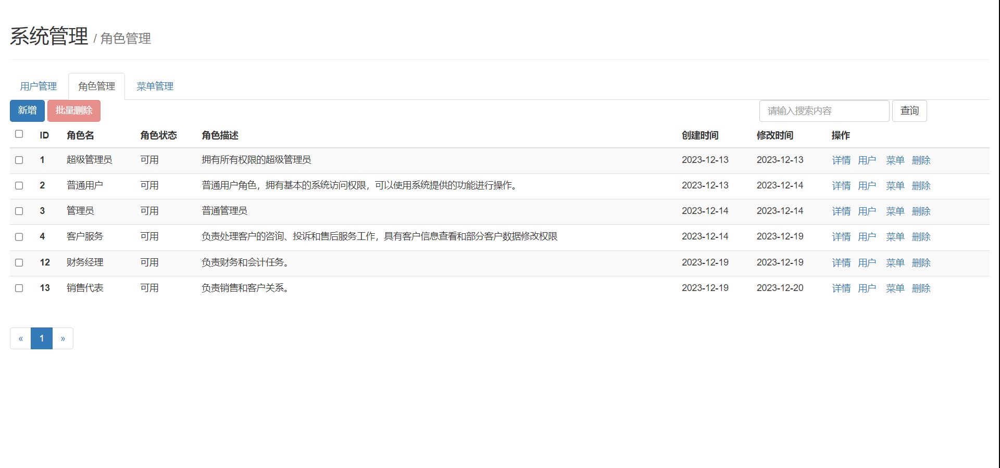
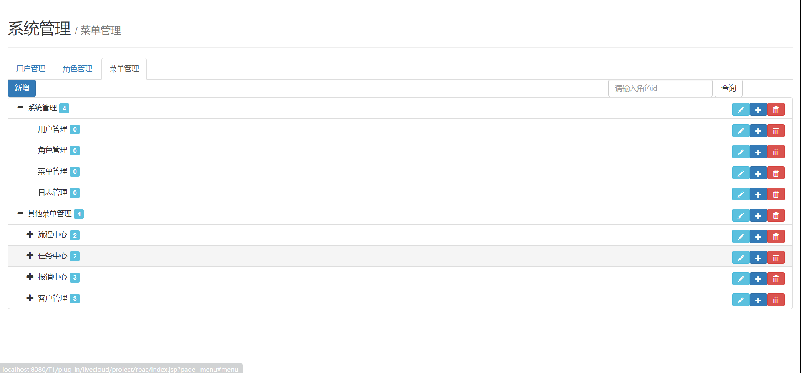

# 1、 系统设计

## 1） 流程图

http://192.168.42.193:8080/?lang=zh



## 2） E-R图



# 2、 表设计

用户表、角色表、菜单表、用户_角色关系表、角色\_菜单关系表


## 1） 用户表:

表名 : CT_Rbac_User

| 名称        | 字段类型     | 是否必填 | 描述             |
| ----------- | ------------ | -------- | ---------------- |
| ID          | int(16)      | 是       | 主键,自增        |
| FNo         | varchar(30)  | 是       | 用户编号         |
| FName       | varchar(30)  | 是       | 用户名           |
| FPassword   | varchar(128) | 是       | 密码             |
| FSex        | int(12)      | 否       | 1\|男;2\|女;     |
| FBirthDay   | datetime     | 否       | 生日, 默认为空   |
| FPhoneNum   | varchar(30)  | 否       | 手机号           |
| FState      | int(12)      | 是       | 0\|正常;1\|禁用; |
| FCreateTime | datetime     | 是       | 创建时间         |
| FUpdateTime | datetime     | 否       | 修改时间         |


## 2） 角色表:

表名: CT_Rbac_Role

| 名称         | 字段类型     | 是否必填 | 描述             |
| ------------ | ------------ | -------- | ---------------- |
| ID           | int(16)      | 是       | 主键, 自增       |
| FName        | varchar(30)  | 是       | 角色名称         |
| FState       | int(12)      | 是       | 0\|正常;1\|禁用; |
| FDescription | varchar(255) | 否       | 角色描述         |
| FCreateTime  | datetime     | 是       | 创建时间         |
| FUpdateTime  | datetime     | 否       | 修改时间         |


## 3） 菜单表:

表名: CT_Rbac_Menu

| 名称         | 字段类型     | 是否必填 | 描述             |
| ------------ | ------------ | -------- | ---------------- |
| ID           | int(16)      | 是       | 主键, 自增       |
| FName        | varchar(30)  | 是       | 菜单名称         |
| FOrder       | int(12)      | 是       | 菜单显示顺序     |
| FLevel       | int(12)      | 是       | 菜单层级         |
| FParentId    | int(16)      | 否       | 父菜单ID         |
| FUrl         | varchar(255) | 否       | 菜单路径         |
| FState       | int(12)      | 是       | 0\|正常;1\|禁用; |
| FDescription | varchar(255) | 否       | 菜单描述         |
| FCreateTime  | datetime     | 是       | 创建时间         |
| FUpdateTime  | datetime     | 否       | 修改时间         |


## 4） 用户_角色关系表:

表名: CT_Rbac_User_Role

| 名称    | 字段类型 | 是否必填 | 描述       |
| ------- | -------- | -------- | ---------- |
| ID      | int(16)  | 是       | 主键, 自增 |
| FUserID | int(16)  | 是       | 用户标识   |
| FRoleID | int(16)  | 是       | 角色标识   |


## 5） 角色_菜单关系表:

表名: CT_Rbac_Role_Menu

| 名称    | 字段类型 | 是否必填 | 描述       |
| ------- | -------- | -------- | ---------- |
| ID      | int(16)  | 是       | 主键, 自增 |
| FRoleID | int(16)  | 是       | 角色标识   |
| FMenuID | int(16)  | 是       | 菜单标识   |


# 3、 接口设计

## 1） 用户crud接口

### a) 查询用户

地址: **/livecloud/project/user.pagex?action=query**

方法: get

数据提交方式: 表单提交

**inputs:** 

```javascript
"pageNo": Number,	// 页码, 非必填
"pageSize": Number,	// 页长, 非必填
"keyword": string,	// 查询关键字, 非必填
"id": Number,		// 查询的用户id, 非必填
"roleId": Number	// 查询的角色id, 非必填
```

**outputs:**

```javascript
{
    "code": Number,		// 识别码
    "success": Boolean,	// 接口是否成功
    "msg": string,		// 消息
    "data": {
        "records": [
            {
                "id": Number,		// 用户id
                "no": string,		// 用户编号
                "name": string,		// 用户名
                "password": string,	// 密码
                "sex": Number,		// 性别
                "birthDay": Date,	// 生日
                "phoneNum": string,	// 手机号
                "state": Number,	// 用户状态
                "createTime": Date,	// 创建时间
                "updateTime": Date	// 修改时间
            },
            ...
        ],
        "total": Number,	// 数据库中的总数目
        "pageNo": Number,
        "pageSize": Number,
            
    }
}
```


### b) 新增用户

地址: **/livecloud/project/user.pagex?action=add**

方法: post

数据提交方式: json格式提交

**inputs:**

```javascript
{
    "no": string,		// 用户编号, 必填且不能重复
    "name": string,		// 用户名, 必填且不能重复
    "phoneNum": string,	// 电话号码
    "sex": Number,		// 性别
    "birthDay": Date,	// 生日
    "phoneNum": string,	// 电话号码
    "state": Number		// 用户状态, 必填, 0可用,1禁用
}
```

**outputs:**

```javascript
{
    "code": Number,
    "success": Boolean,
    "msg": string,
}
```


### c) 修改用户

地址: **/livecloud/project/user.pagex?action=update**

方法: post

数据提交方式: json格式提交

**inputs:**

```typescript
{
    "id": Number,		// 用户标识, 必填
    "no": string,		// 用户编号, 必填
    "name": string,		// 用户名, 必填
    "password": string,	// 密码, 非必填, 为null表示没有修改密码
    "phoneNum": string,	// 电话号码
    "sex": Number,		// 性别
    "birthDay": Date,	// 生日
    "phoneNum": string	// 电话号码
    "state": Number		// 用户状态, 必填, 0可用,1禁用
}
```

**outputs:**

```javascript
{
    "code": Number,
    "success": Boolean,
    "msg": string
}
```


### d) 删除用户

地址: **/livecloud/project/user.pagex?action=delete**

方法: post

数据提交方式: 表单提交

**inputs:**

```typescript
"id": Number	// 用户标识, 必填
```

**outputs:**

```javascript
{
    "code": Number,
    "success": Boolean,
    "msg": string,
}
```


## 2） 角色crud接口

### a) 查询角色

地址: **/livecloud/project/role.pagex?action=query**

方法: get

数据提交方式: 表单提交

**inputs:**

```javascript
"pageNo": Number,	// 页码, 非必填
"pageSize": Number,	// 页长, 非必填
"keyword": string,	// 查询关键字, 非必填
"userId": Number	// 要查询的用户id, 非必填
"roleId": Number	// 要查询的角色id, 非必填
```

**outputs:**

```javascript
{
    "code": Number,
    "success": Boolean,
    "msg": string,
    "data": {
        "records": [
            {
                "id": Number,			// 角色标识
                "name": string,			// 角色名
                "description": string,	// 角色描述
                "state": Number,		// 角色状态,  0可用,1禁用
                "createTime": Date,		// 创建时间
                "updateTime": Date		// 修改时间
            },
        	...
    	],
        "total": Number,
        "pageNo": Number,
       	"pageSize": Number,
    }
}
```


### b) 新增角色

地址: **/livecloud/project/role.pagex?action=add**

方法: post

数据提交方式: json格式提交

**inputs:**

```typescript
{
    "name": string,			// 角色名, 必填
    "state": Number,		// 角色状态, 必填
	"description": string	// 角色描述
}
```

**outputs:**

```javascript
{
    "code": Number,
    "success": Boolean,
    "msg": string,
}
```


### c) 修改角色

地址: **/livecloud/project/role.pagex?action=update**

方法: post

数据提交方式: json格式提交

**inputs:**

```javascript
{
    "id": Number,			// 角色标识, 必填
    "name": string,			// 角色名, 必填
    "state": Number,		// 角色状态, 必填,  0可用,1禁用
    "description": string	// 角色描述
}
```

**outputs:**

```javascript
{
    "code": Number,
    "success": Boolean,
    "msg": string,
}
```


### d) 给用户授权角色

地址: **/livecloud/project/userRole.pagex?action=update**

方法: post

数据提交方式: json格式提交

**inputs:**

```typescript
{
    "id": Number,		// 要修改的角色id, 必填
    "addList": Array,	// 要添加的用户id列表
    "deleteList": Array	// 要删除的用户id列表
}
```

**outputs:**

```javascript
{
    "code": Number,
    "success": Boolean,
    "msg": string,
}
```


### e) 修改角色的菜单

地址: **/livecloud/project/roleMenu.pagex?action=update**

方法: post

数据提交方式: json格式提交

**inputs:**

```typescript
{
    "id": Number,		// 要修改的角色id, 必填
    "addList": Array,	// 要添加的菜单id列表
    "deleteList": Array	// 要删除的菜单id列表
}
```

**outputs:**

```javascript
{
    "code": Number,
    "success": Boolean,
    "msg": string,
}
```


### f) 删除角色

地址: **/livecloud/project/role.pagex?action=delete**

方法: post

数据提交方式: 表单提交

**inputs:**

```javascript
"id": Number	// 角色标识, 必填
```

**outputs:**

```javascript
{
    "code": Number,
    "success": Boolean,
    "msg": string,
}
```


## 3） 菜单crud接口


### a) 查询菜单树

地址: **/livecloud/project/menu.pagex?action=query**

方法: get

数据提交方式: 表单提交

**inputs: **

```javascript
"roleId": Number,	// 角色id, 非必填
"id": Number,	// 菜单id, 非必填
"userId": Number	// 用户id, 非必填
```

**outputs:**

```javascript
{
    "code": Number,
    "success": Boolean,
    "msg": string,
    "data": [
        {
            "id": string,			// 菜单标识
            "name": string,			// 菜单名
            "order": Number,		// 菜单显示顺序
            "level": Number,		// 菜单层级
            "parentId": Number,		// 父菜单id
            "url": string,			// 菜单路径
            "state": Number,		// 菜单状态, 0可用, 1禁用
            "description": string,	// 菜单描述
            "createTime": Date,		// 创建时间
            "updateTime": Date,		// 修改时间
            "children": [
                {
                    "id": string,			// 菜单标识
                    "name": string,			// 菜单名
                    "order": Number,		// 菜单显示顺序
                    "level": Number,		// 菜单层级
                    "parentId": Number,		// 父菜单id
                    "url": string,			// 菜单路径
                    "state": Number,		// 菜单状态, 0可用, 1禁用
                    "description": string,	// 菜单描述
                    "createTime": Date,		// 创建时间
                    "updateTime": Date		// 修改时间
                    "children": [
                        ...
                    ]
                },
                ...
            ]
        },
        ...
    ]
}
```


### b) 新增菜单

地址: **/livecloud/project/menu.pagex?action=add**

方法: post

数据提交方式: json格式提交

**inputs:**

```javascript
{
    "name": string,			// 菜单名, 必填
    "order": Number,		// 菜单显示顺序, 必填
    "level": Number,		// 菜单层级, 必填
    "parentId": Number,		// 父菜单id, 必填
    "url": string,			// 菜单路径
    "state": Number,		// 菜单状态, 0可用, 1禁用
    "description": string	// 菜单描述
}

```

**outputs:**

```javascript
{
    "code": Number,
    "success": Boolean,
    "msg": string
}
```


### c) 修改菜单

地址: **/livecloud/project/menu.pagex?action=update**

方法: post

数据提交方式: json格式提交

**inputs:**

```javascript
{
    "id": Number,			// 菜单标识, 必填
    "name": string,			// 菜单名, 必填
    "order": Number,		// 菜单显示顺序, 必填
    "level": Number,		// 菜单层级, 必填
    "parentId": Number,		// 父菜单id, 必填
    "url": string,			// 菜单路径
    "state": Number,		// 菜单状态, 0可用, 1禁用
    "description": string	// 菜单描述
}
```

**outputs:**

```javascript
{
    "code": Number,
    "success": Boolean,
    "msg": string
}
```


### d) 删除菜单

地址: **/livecloud/project/menu.pagex?action=delete**

方法: post

数据提交方式: 表单提交

**inputs:**

```typescript
"id": Number	// 菜单标识
```

**outputs:**

```javascript
{
    "code": Number,
    "success": Boolean,
    "msg": string
}
```

# 4、 页面设计

## 1） 用户列表



## 2） 角色列表



## 3） 菜单列表

