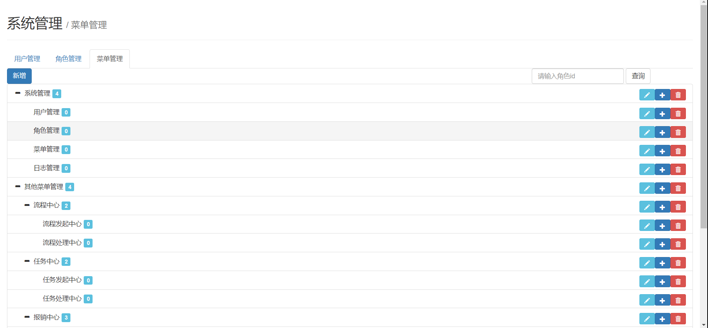

#   一、 系统设计

## 2. 流程图

http://192.168.42.193:8080/?lang=zh


## 3. E-R图


# 二、 表设计

用户表、角色表、菜单表、用户_角色关系表、角色\_菜单关系表


## 1. 用户表:

表名 : CT_Rbac_User

| 名称        | 字段类型     | 是否必填 | 描述                          |
| ----------- | ------------ | -------- | ----------------------------- |
| ID          | int(16)      | 是       | 主键,自增                     |
| FUserName   | varchar(30)  | 是       | 用户标识, 唯一                |
| FName       | varchar(30)  | 是       | 用户名                        |
| FPassword   | varchar(128) | 是       | 密码                          |
| FSex        | int(12)      | 是       | 性别, 1\|男;0\|女;            |
| FBirthDay   | datetime     | 否       | 生日, 默认为空                |
| FPhoneNum   | varchar(30)  | 否       | 电话号码                      |
| FState      | int(12)      | 是       | 状态, 1\|正常;0\|禁用;2\|删除 |
| FCreateTime | datetime     | 是       | 创建时间                      |
| FUpdateTime | datetime     | 否       | 修改时间                      |


## 2. 角色表:

表名: CT_Rbac_Role

| 名称         | 字段类型     | 是否必填 | 描述                        |
| ------------ | ------------ | -------- | --------------------------- |
| ID           | int(16)      | 是       | 主键, 自增                  |
| FRoleName    | varchar(30)  | 是       | 角色标识, 唯一              |
| FName        | varchar(30)  | 是       | 角色名称                    |
| FState       | int(12)      | 是       | 状态, 1\|正常;0\|禁用;2删除 |
| FDescription | varchar(255) | 否       | 角色描述                    |
| FCreateTime  | datetime     | 是       | 创建时间                    |
| FUpdateTime  | datetime     | 否       | 修改时间                    |


## 3. 菜单表:

表名: CT_Rbac_Menu

| 名称         | 字段类型     | 是否必填 | 描述                        |
| ------------ | ------------ | -------- | --------------------------- |
| ID           | int(16)      | 是       | 主键, 自增                  |
| FName        | varchar(30)  | 是       | 菜单名称                    |
| FOrder       | int(12)      | 是       | 菜单显示顺序                |
| FLevel       | int(12)      | 是       | 菜单层级                    |
| FParentId    | int(16)      | 是       | 父菜单ID, 0表示没有父菜单   |
| FUrl         | varchar(255) | 否       | 菜单路径                    |
| FState       | int(12)      | 是       | 状态, 1\|正常;0\|禁用;2删除 |
| FDescription | varchar(255) | 否       | 菜单描述                    |
| FCreateTime  | datetime     | 是       | 创建时间                    |
| FUpdateTime  | datetime     | 否       | 修改时间                    |


## 4. 用户_角色关系表:

表名: CT_Rbac_User_Role

| 名称    | 字段类型 | 是否必填 | 描述       |
| ------- | -------- | -------- | ---------- |
| ID      | int(16)  | 是       | 主键, 自增 |
| FUserId | int(16)  | 是       | 用户主键   |
| FRoleId | int(16)  | 是       | 角色主键   |


## 5. 角色_菜单关系表:

表名: CT_Rbac_Role_Menu

| 名称    | 字段类型 | 是否必填 | 描述       |
| ------- | -------- | -------- | ---------- |
| ID      | int(16)  | 是       | 主键, 自增 |
| FRoleId | int(16)  | 是       | 角色主键   |
| FMenuId | int(16)  | 是       | 菜单主键   |


# 三、 接口设计

## 1） 用户crud接口

### 1) 查询所有用户

地址: **/livecloud/project/user.pagex?action=queryAll**

方法: get

数据提交方式: url参数拼接

**inputs:** 

```javascript
{
    "pageNo": number,	// 页码, 必填
    "pageSize": number,	// 页长, 必填
    "keyword": string	// 查询关键字, 非必填
}
```

**outputs:**

```javascript
{
    "code": number,		// 识别码
    "success": boolean,	// 接口是否成功
    "msg": string,		// 消息
    "data": {
        "records": [
            {
                "id": number,		// 用户主键
                "userName": string,	// 用户标识
                "name": string,		// 用户名
                "sex": number,		// 性别, 1|男;0|女;
                "birthDay": date,	// 出生日期
                "phoneNum": string,	// 电话号码
                "state": number,	// 用户状态, 1正常,0禁用,2删除
                "createTime": date,	// 创建时间
                "updateTime": date	// 修改时间
            },
            ...
        ],
        "total": number,	// 总数
        "pageNo": number,	// 页码
        "pageSize": number	// 页长
    }
}
```


### 2) 根据用户主键查询用户

地址: **/livecloud/project/user.pagex?action=queryByUserId**

方法: get

数据提交方式: url参数拼接

**inputs:** 

```javascript
{
    "id": number,		// 要查询的用户主键, 必填
}
```

**outputs:**

```javascript
{
    "code": number,		// 识别码
    "success": boolean,	// 接口是否成功
    "msg": string,		// 消息
    "data": {
        "id": number,		// 用户主键
        "userName": string,	// 用户标识
        "name": string,		// 用户名
        "sex": number,		// 性别, 1|男;0|女;
        "birthDay": date,	// 出生日期
        "phoneNum": string,	// 电话号码
        "state": number,	// 用户状态,1正常,0禁用,2删除
        "createTime": date,	// 创建时间
        "updateTime": date	// 修改时间
    }
}
```


### 3) 根据角色主键查询用户

地址: **/livecloud/project/userRole.pagex?action=queryByRoleId**

方法: get

数据提交方式: url参数拼接

**inputs:** 

```javascript
{
    "id": number	// 要查询的角色主键, 必填
}
```

**outputs:**

```javascript
{
    "code": number,		// 识别码
    "success": boolean,	// 接口是否成功
    "msg": string,		// 消息
    "data": [
        {
            "id": number,		// 用户主键
            "userName": string,	// 用户标识
            "name": string,		// 用户名
            "sex": number,		// 性别, 1|男;0|女;
            "birthDay": date,	// 出生日期
            "phoneNum": string,	// 电话号码
            "state": number,	// 用户状态,1正常,0禁用,2删除
            "createTime": date,	// 创建时间
            "updateTime": date	// 修改时间
        },
        ...
    ]
}
```


### 4) 新增用户

地址: **/livecloud/project/user.pagex?action=add**

方法: post

数据提交方式: json格式提交

**inputs:**

```javascript
{
    "userName": string,	// 用户标识, 必填且不能重复
    "name": string,		// 用户名, 必填
    "sex": number,		// 性别, 必填, 1|男;0|女;
    "phoneNum": string,	// 电话号码
    "birthDay": date,	// 出生日期
}
```

**outputs:**

```javascript
{
    "code": number,		// 识别码
    "success": boolean,	// 接口是否成功
    "msg": string		// 消息
}
```


### 5) 修改用户

地址: **/livecloud/project/user.pagex?action=update**

方法: post

数据提交方式: json格式提交

**inputs:**

```typescript
{
    "id": number,		// 要修改的用户主键, 必填
    "name": string,		// 用户名, 必填
    "sex": number,		// 性别, 必填, 1|男;0|女;
    "phoneNum": string,	// 电话号码
    "birthDay": date,	// 出生日期
    "state": number		// 用户状态, 必填,1正常,0禁用,2删除
}
```

**outputs:**

```javascript
{
    "code": number,		// 识别码
    "success": boolean,	// 接口是否成功
    "msg": string		// 消息
}
```


### 6) 修改用户密码

地址: **/livecloud/project/user.pagex?action=updatePassword**

方法: post

数据提交方式: json格式提交

**inputs:**

```typescript
{
    "id": number,				// 要修改的用户主键
    "oldPassword": string,		// 旧密码, 后端加密方式为md5加密
    "password": string,			// 新密码
    "checkedPassword": string	// 确认密码
}
```

**outputs:**

```javascript
{
    "code": number,		// 识别码
    "success": boolean,	// 接口是否成功
    "msg": string		// 消息
}
```


### 7) 删除用户

地址: **/livecloud/project/user.pagex?action=delete**

方法: post

数据提交方式: json格式提交

**inputs:**

```typescript
{
    "id": number	// 用户主键, 必填
}
```

**outputs:**

```javascript
{
    "code": number,		// 识别码
    "success": boolean,	// 接口是否成功
    "msg": string		// 消息
}
```


## 2） 角色crud接口

### 1) 查询所有角色

地址: **/livecloud/project/role.pagex?action=queryAll**

方法: get

数据提交方式: url参数拼接

**inputs:**

```javascript
"pageNo": number,	// 页码, 必填
"pageSize": number,	// 页长, 必填
"keyword": string,	// 查询关键字, 非必填
```

**outputs:**

```javascript
{
    "code": number,		// 识别码
    "success": boolean,	// 接口是否成功
    "msg": string,		// 消息
    "data": {
        "records": [
            {
                "id": number,			// 角色主键
                "roleName": string,		// 角色标识
                "name": string,			// 角色名
                "state": number,		// 角色状态,1正常,0禁用,2删除
                "description": string,	// 角色描述
                "createTime": date,		// 创建时间
                "updateTime": date		// 修改时间
            },
        	...
    	],
        "total": number,	// 总数
        "pageNo": number,	// 页码
       	"pageSize": number	// 页长
    }
}
```


### 2) 根据用户主键查询角色

地址: **/livecloud/project/userRole.pagex?action=queryByUserId**

方法: get

数据提交方式: url参数拼接

**inputs:**

```javascript
"id": number	// 要查询的用户主键, 必填
```

**outputs:**

```javascript
{
    "code": number,		// 识别码
    "success": boolean,	// 接口是否成功
    "msg": string,		// 消息
    "data": [
        {
            "id": number,			// 角色主键
            "roleName": string,		// 角色标识
            "name": string,			// 角色名
            "state": number,		// 角色状态,  1正常,0禁用,2删除
            "description": string,	// 角色描述
            "createTime": date,		// 创建时间
            "updateTime": date		// 修改时间
        },
        ...
    ],
}
```


### 3) 根据角色主键查询角色

地址: **/livecloud/project/role.pagex?action=queryByRoleId**

方法: get

数据提交方式: url参数拼接

**inputs:**

```javascript
"id": number	// 要查询的角色主键, 必填
```

**outputs:**

```javascript
{
    "code": number,		// 识别码
    "success": boolean,	// 接口是否成功
    "msg": string,		// 消息
    "data": {
        "id": number,			// 角色主键
        "roleName": string,		// 角色标识
        "name": string,			// 角色名
        "state": number,		// 角色状态,  1正常,0禁用,2删除
        "description": string,	// 角色描述
        "createTime": date,		// 创建时间
        "updateTime": date		// 修改时间
    }
}
```


### 4) 新增角色

地址: **/livecloud/project/role.pagex?action=add**

方法: post

数据提交方式: json格式提交

**inputs:**

```typescript
{
    "roleName": string,		// 角色编码, 必填
    "name": string,			// 角色名, 必填
	"description": string	// 角色描述
}
```

**outputs:**

```javascript
{
    "code": number,		// 识别码
    "success": boolean,	// 接口是否成功
    "msg": string		// 消息
}
```


### 5) 修改角色

地址: **/livecloud/project/role.pagex?action=update**

方法: post

数据提交方式: json格式提交

**inputs:**

```javascript
{
    "id": number,			// 角色主键, 必填
    "name": string,			// 角色名, 必填
    "state": number,		// 角色状态, 必填,  1正常,0禁用,2删除
    "description": string	// 角色描述
}
```

**outputs:**

```javascript
{
    "code": number,		// 识别码
    "success": boolean,	// 接口是否成功
    "msg": string		// 消息
}
```


### 6) 给用户授权角色

地址: **/livecloud/project/userRole.pagex?action=update**

方法: post

数据提交方式: json格式提交

**inputs:**

```typescript
{
    "id": number,				// 要授权的角色主键, 必填
    "addIds": number|1,2,3,		// 要添加的用户主键列表, (number数组)
    "deleteIds": number|1,2,3	// 要删除的用户主键列表, (number数组)
}
```

**outputs:**

```javascript
{
    "code": number,		// 识别码
    "success": boolean,	// 接口是否成功
    "msg": string		// 消息
}
```


### 7) 修改角色的菜单

地址: **/livecloud/project/roleMenu.pagex?action=update**

方法: post

数据提交方式: json格式提交

**inputs:**

```typescript
{
    "id": number,				// 要修改的角色主键, 必填
    "addIds": number|1,2,3		// 要添加的菜单主键列表, (number数组)
    "deleteIds": number|1,2,3	// 要删除的菜单主键列表, (number数组)
}
```

**outputs:**

```javascript
{
    "code": number,		// 识别码
    "success": boolean,	// 接口是否成功
    "msg": string		// 消息
}
```


### 8) 删除角色

地址: **/livecloud/project/role.pagex?action=delete**

方法: post

数据提交方式: json格式提交

**inputs:**

```javascript
{
    "id": number	// 角色主键, 必填
}
```

**outputs:**

```javascript
{
    "code": number,		// 识别码
    "success": boolean,	// 接口是否成功
    "msg": string		// 消息
}
```


## 3） 菜单crud接口


### 1) 根据用户主键查询菜单树

地址: **/livecloud/project/userMenu.pagex?action=queryByUserId**

方法: get

数据提交方式: url参数拼接

**inputs: ** 

```javascript
{
    "id": number	// 用户主键. 必填
}
```

**outputs:**

```javascript
{
    "code": number,		// 识别码
    "success": boolean,	// 接口是否成功
    "msg": string,		// 消息
    "data": [
        {
            "id": number,			// 菜单主键
            "name": string,			// 菜单名
            "order": number,		// 菜单显示顺序
            "parentId": number,		// 父菜单主键
            "url": string,			// 菜单路径
            "state": number,		// 菜单状态,1正常,0禁用,2删除
            "description": string,	// 菜单描述
            "children": [
                {
                    "id": number,			// 菜单主键
                    "name": string,			// 菜单名
                    "order": number,		// 菜单显示顺序
                    "parentId": number,		// 父菜单主键
                    "url": string,			// 菜单路径
                    "state": number,		// 菜单状态, 1正常,0禁用,2删除
                    "description": string,	// 菜单描述
                    "children": [
                        ...
                    ]
                },
                ...
            ]
        },
        ...
    ]
}
```


### 2) 根据角色主键查询菜单树

地址: **/livecloud/project/roleMenu.pagex?action=queryByRoleId**

方法: get

数据提交方式: url参数拼接

**inputs: ** 

```javascript
{
    "id": number	// 角色主键. 必填
}
```

**outputs:**

```javascript
{
    "code": number,		// 识别码
    "success": boolean,	// 接口是否成功
    "msg": string,		// 消息
    "data": [
        {
            "id": number,			// 菜单主键
            "name": string,			// 菜单名
            "order": number,		// 菜单显示顺序
            "parentId": number,		// 父菜单主键
            "url": string,			// 菜单路径
            "state": number,		// 菜单状态,1正常,0禁用,2删除
            "description": string,	// 菜单描述
            "children": [
                {
                    "id": number,			// 菜单主键
                    "name": string,			// 菜单名
                    "order": number,		// 菜单显示顺序
                    "parentId": number,		// 父菜单主键
                    "url": string,			// 菜单路径
                    "state": number,		// 菜单状态,1正常,0禁用,2删除
                    "description": string,	// 菜单描述
                    "children": [
                        ...
                    ]
                },
                ...
            ]
        },
        ...
    ]
}
```


### 3) 根据菜单主键查询菜单

地址: **/livecloud/project/menu.pagex?action=queryByMenuId**

方法: get

数据提交方式: url参数拼接

**inputs: ** 

```javascript
{
    "id": number	// 菜单主键. 必填
}
```

**outputs:**

```javascript
{
    "code": number,		// 识别码
    "success": boolean,	// 接口是否成功
    "msg": string,		// 消息
    "data": {
        "id": number,			// 菜单主键
        "name": string,			// 菜单名
        "order": number,		// 菜单显示顺序
        "level": number,		// 菜单层级
        "parentId": number,		// 父菜单主键
        "url": string,			// 菜单路径
        "state": number,		// 菜单状态,1正常,0禁用,2删除
        "description": string,	// 菜单描述
        "createTime": date,		// 创建时间
        "updateTime": date,		// 修改时间
    }
}
```


### 4) 新增菜单

地址: **/livecloud/project/menu.pagex?action=add**

方法: post

数据提交方式: json格式提交

**inputs:**

```javascript
{
    "name": string,			// 菜单名, 必填
    "order": number,		// 菜单显示顺序, 必填
    "parentId": number,		// 父菜单主键, 必填 (0表示没有父菜单)
    "url": string,			// 菜单路径
    "description": string	// 菜单描述
}
```

**outputs:**

```javascript
{
    "code": number,		// 识别码
    "success": boolean,	// 接口是否成功
    "msg": string		// 消息
}
```


### 5) 修改菜单

地址: **/livecloud/project/menu.pagex?action=update**

方法: post

数据提交方式: json格式提交

**inputs:**

```javascript
{
    "id": number,			// 菜单主键, 必填
    "name": string,			// 菜单名, 必填
    "order": number,		// 菜单显示顺序, 必填
    "parentId": number,		// 父菜单主键, 必填 (0表示没有父菜单)
    "url": string,			// 菜单路径
    "state": number,		// 菜单状态, 必填,1正常,0禁用,2删除
    "description": string	// 菜单描述
}
```

**outputs:**

```javascript
{
    "code": number,		// 识别码
    "success": boolean,	// 接口是否成功
    "msg": string		// 消息
}
```


### 6) 删除菜单

地址: **/livecloud/project/menu.pagex?action=delete**

方法: post

数据提交方式: json格式提交

**inputs:**

```typescript
{
    "id": number	// 菜单主键, 必填
}
```

**outputs:**

```javascript
{
    "code": number,		// 识别码
    "success": boolean,	// 接口是否成功
    "msg": string		// 消息
}
```

# 三、 页面设计

## 1） 用户列表


## 2） 角色列表


## 3） 菜单列表

